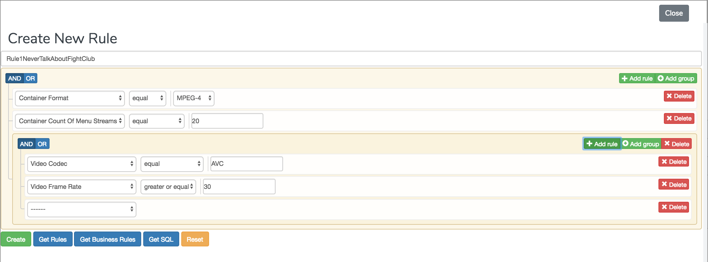
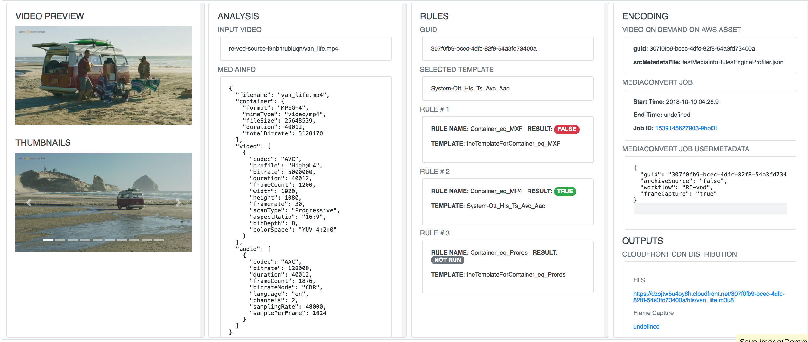
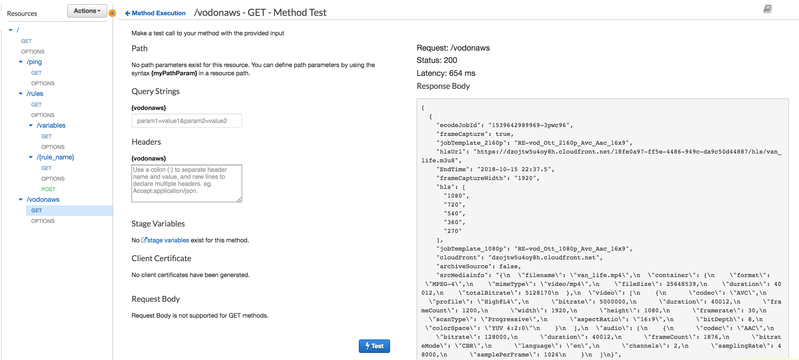
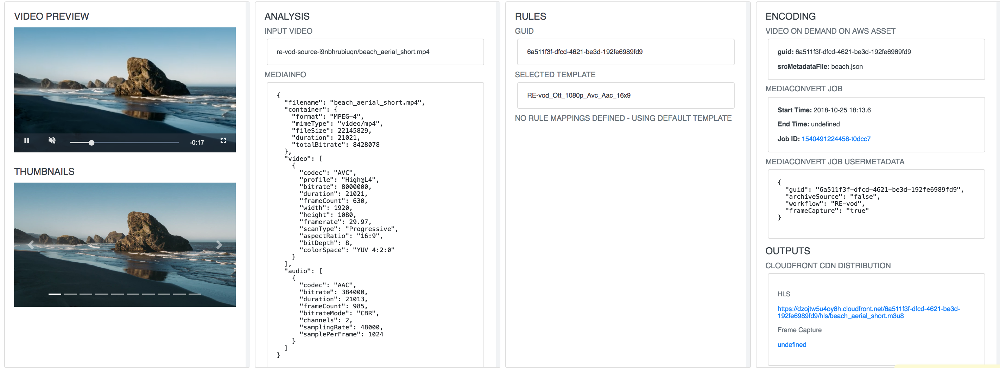
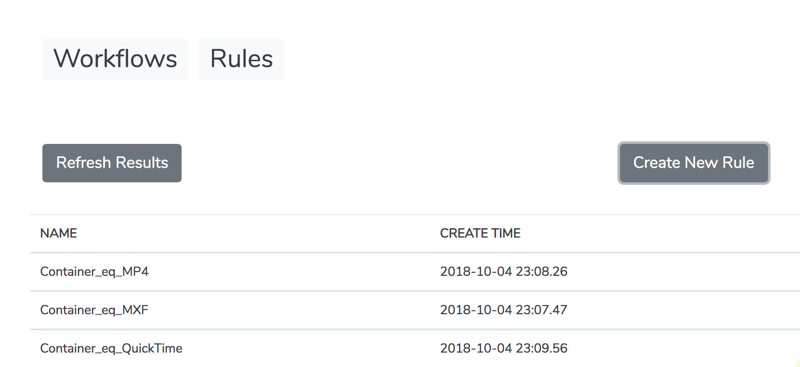
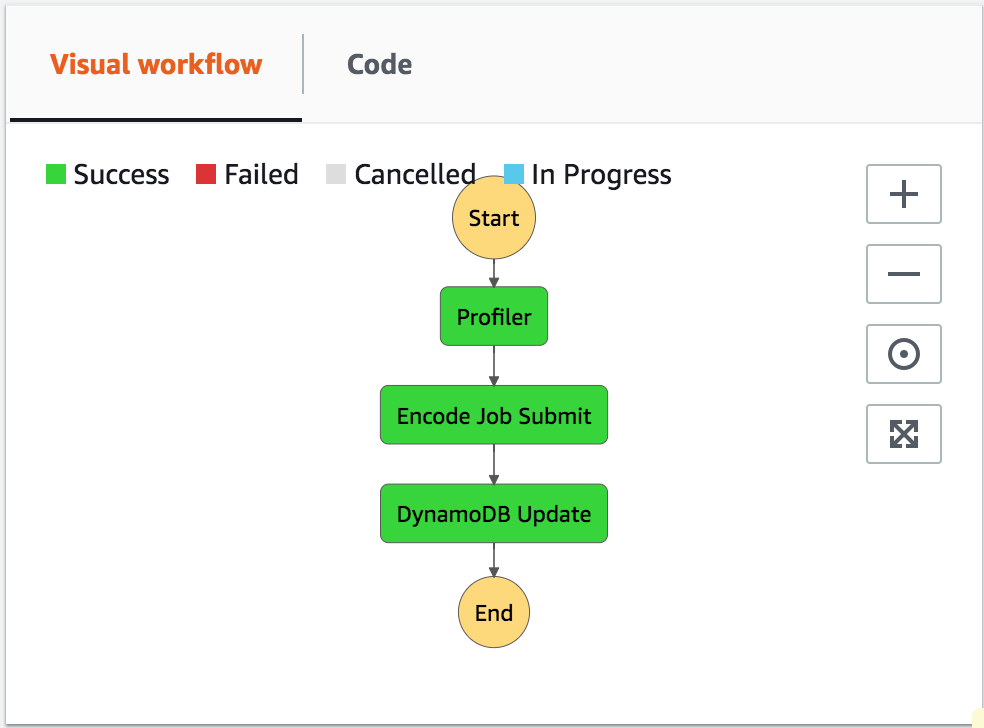
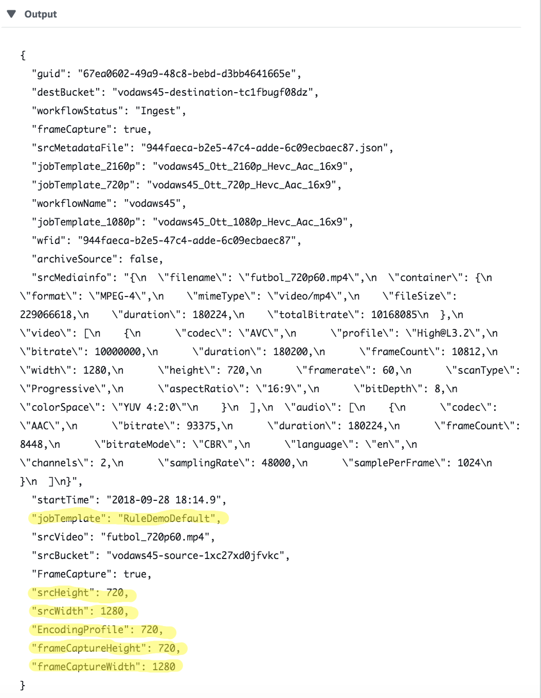

# Customizing the Video On Demand on AWS workflow to use dynamic rules

The Video on Demand on AWS solution leverages AWS Step Functions, which breaks the workflow into individual steps, making it easier to customize or extend the architecture for your specific video-on-demand needs. For example, you can modify or replace the encoding steps to produce different content sets. You can also add steps to extend support for more complex workflows, including, for example, image processing for poster artwork or additional custom data to the metadata file that will then be stored in Amazon DynamoDB. 

In this module, you will customize the VOD solution to use user-defined rules to automatically select which MediaConvert template will be used as the encoding settings for a specific input.  This change will enable end users who may have access to MediaConvert and the solution S3 bucket, but not the internals of the solution, to develop new video processing workflows without modifying the underlying code for the solution.

The Video on Demand solution already implements some hard-coded rules that we will replace with dynamic rules.  The existing rules checks the Mediainfo analysis results of the input video and decides on a job template that will avoid producing  _up-converted_ video outputs -  that is videos with a higher resolution than the input video.

When this module is complete the end user experience for using the Video on Demand on AWS solutions will be as follows: 

1. Create MediaConvert templates (e.g using the AWS Elemental MediaConvert console).  In our workshop, we will be using existing templates that were either generated from the lab toolkit or system templates provided by MediaConvert.  However, the new workflow supports any MediaConvert template.

    

2. Create Mediainfo Rules using form input on a webpage.  Rules are stored in Dynamodb and can be retrieved by name via an API or AWS Lambda.

    

3. Use input JSON metadata to trigger Video on Demand on AWS workflows. The metadata includes **_Rule Mappings_** to decide on which MediaConvert Template should be used for a specific input using JSON metadata.
  
    

4. View the results of the Video on Demand on AWS jobs in the Workflow webpage.

    

# Overview of Implementation Steps:

The changes to the Video on Demand on AWS solution that are needed to support the new workflow are as follows:

1. Change the Video on Demand on AWS solution user interface (S3 bucket watchfolder) to take a file containing JSON metadata as input, including **Rule Mappings**.  
2. Deploy and configure a serverless web application for creating named expressions, called **_Mediainfo Rules_**, that can be evaluated against facts from Mediainfo metadata for a video.
3. Deploy and configure a **_Mediainfo Rules Engine_** lambda function that take Mediainfo metadata for a specific video and evaluates a list of Mediainfo Rules and returns the result. 
4. Change the Video on Demand on AWS solution to use the Mediainfo Rules Engine lambda in place of the existing logic to select a job template for a given input.

### Open source

The following Open Source packages are used to develop this customization.

* [**jQuery QueryBuilder**](https://querybuilder.js.org/)  An open source javascript package that lets you build expressions using a web UI and translates the expression into different query engine formats such as SQL, Elastic Search, etc.  We will be translating the expressions to _business-rules_ JSON format.

* [**business-rules**](https://github.com/venmo/business-rules) - an Open Source Python package that lets you execute rules against a set of configured variables.

# Prerequisites

1. Amazon Web Services account with root or Administrator permissions
2. Video On Demand on AWS stack deployed in the same region you will complete the lab in.
3. Google Chrome, Mozilla Firefox, or another current browser with JavaScript enabled.  Google Chrome is recommended.

# Deploy the Lab Toolkit

The lab toolkit is installed in your account using the Workshop.yaml CloudFormation template.  This template runs several nested Cloudformation templates that create the S3, API Gateway, IAM and Lambda resources needed to complete the workshop.  We will examine the resources created and modify them as we proceed through the tutorial.  

During the installation of the Cloudformation templates you may be prompted to acknowledge the creation of IAM resources.  Click on the check-boxes next to each entry.  Finally,  click the **Create** or **Create Change set** and **Execute** buttons where applicable.


## Run the template

A CloudFormation template is provided for this module in the file `workshop.yaml` to build the resources automatically.  We will refer to this stack as "the **workshop** stack" throughout this module.

Click **Launch Stack** to launch the template in your account in the region of your choice:


Region | Launch
------|-----


US West 2 (Oregon) | [](https://console.aws.amazon.com/cloudformation/home?region=us-west-2#/stacks/new?stackName=ruleweb&templateURL=https://s3.amazonaws.com/rodeolabz-us-west-2/rules/3-rulesbasedencoding/v3/workshop.yaml)

EU West 1 (Ireland) | [](https://console.aws.amazon.com/cloudformation/home?region=eu-west-1#/stacks/new?stackName=ruleweb&templateURL=https://s3.amazonaws.com/rodeolabz-eu-west-1/rules/3-rulesbasedencoding/v3/workshop.yaml)

### Parameters

**vodstack** - the name of the Video on Demand Solution stack to use as a base for the rule based encoding workflow.

### Outputs

The information about the resources created by this stack is in the **Outputs** tab of the stack.  For convienience, the outputs of the Video on Demand solution stack are also passed through and listed in the Outputs.  Save this page in a browser tab so you can refer to it later. 

Save this page in a browser tab for future reference.  Or, copy and save the outputs to a file.

FIXME 


* **APIHandlerArn** - ARN of the Lambda function that serves as the back-end for the /rule and /vodonaws APIs
* **APIHandlerName** - Name of the Lambda function that serves as the back-end for the /rule and /vodonaws APIs
* **APIEndpointURL** - HTTPS endpoint for the Rules and Workflow API endpoint	
* **APIKey** - 	API Key for testing	the Rules and Workflow API
* **WebsiteURL** - Workflow Monitoring page and Rule creation	webpages
* **WorkflowCloudFront** - CloudFront Domain Name	for the Video on Demand on AWS solution
* **WorkflowSource** - Source Bucket for the Video on Demand on AWS solution	
* **WorkflowDestination** -	Destination Bucket for the Video on Demand on AWS solution	
* **WorkflowDynamoDBTable** - DynamoDB Table for the Video on Demand on AWS solution	
* **RulesTableName** - Dynamodb Table for Rules API
  
### Other resources

We will also use the following resources created by the ruleapi nested stack:

* **MediainfoRulesEngine** - standalone lambda that evaluates a list of Mediainfo Rules against an input mediainfo JSON object.
* **MediainfoRulesEngineProfiler** - a replacement lambda for the exisisting Video on Demand on AWS profiler lambda.

# Part 1: Change the Video on Demand on AWS S3 trigger to use input Metadata

The Video on Demand on AWS solution supports two types of S3 workflow triggers:

1. **Video-Only Workflow** 
   
   When a new MP4, MPG, M4V, or MOV video is added to the source Amazon S3 bucket, a Lambda function triggers the ingest workflow. 

2. **Metadata and Video Workflow**
    
    When a new JSON metadata file is added to the source Amazon S3 bucket, a Lambda function triggers the ingest workflow. 

Since we deployed the solution stack using the default, Video-Only Workflow trigger, we will need to change the S3 trigger setting to start the workflow using Metadata and Video.
 
Once the Metadata and Video Workflow is enabled, any key-value pairs we add to the Metadata input file will be available to the Step Functions and Lambdas throughout the workflow. Each time the workflow is initiated, the solution creates a unique identifier (guid). All metadata including the input Metadata is stored in Dynamodb.  The unique identifier is used as the primary key in Amazon DynamoDB and the execution ID in AWS Step Functions. The unique identifier is passed to each step in the workflow, allowing information to be stored and retrieved in DynamoDB. 

We will take advantage of Metadata to allow end-users to pass in addtional infomation about how to select templates from rules.

## Instructions

Use the steps below to change the **S3 ObjectCreate (All)** event trigger on the **Source** bucket to only triger if the object created in the bucket has a suffix of "json".  We don't need to make any other changes to the stack since the workflow will automatically handle extracting metadata from .json files.

1. Open the S3 console.
2. Find the **Source** bucket created by the **vod-on-aws** stack and click on the link to open the detail page for the bucket. The bucket name will have a pattern like: `vod-on-aws-source-<unique-string>`.
3. Navigate to the **Properties** tab and click on the **Events** tile in the **Advanced settings** panel at the bottom of the page.
4. On the **Event** card select the radio button for the first **ObjectCreate (All)** event trigger and click on the **Edit** link.
5. Replace the existing value in the **Suffix** box with  `json` and click **Save** to update the trigger.
   
      

6. On the **Event** card, select the radio button for each non-json  **ObjectCreate (All)** event trigger and click on the **Delete** button.  The only remaining trigger should be the JSON trigger. 

    


## Test the metadata trigger

Now let's create a Video on Demand on AWS workflow using the Metadata trigger.  We'll add an extra, arbitrary,  key-value pair to pass a message to ourselves through the solution  to show we can add things here that are persisted in the Dynamodb data stored for the workflow guid.

1. On your computer, create a file called `testMetadata.json`
2. Copy the following JSON into the file and save.
    ```json
    {
      "hls": [720, 540, 360, 270],  
      "srcVideo": "van_life.mp4", 
      "FrameCapture": true,
      "MetadataTestMessage": "Hello from the other side!" 
    }
    ```
3. Open the S3 console and click on the link for the **Source** bucket that was created by the Video on Demand on AWS workflow.
4. Click on the **Upload** button and use the dialog box to locate and select the `testMetadata.json` input metadata file you just created.
5. Click on the **Upload** button to start the upload.
6. To verify the job triggered, open the MediaConvert console and make sure a job was started with the input `van_life.mp4`.

FIXME - show the metadata is carried through the job.  This should be in the the MediaConvert UserMetadata but it's not.

# Part 2: Configure a serverless application to create and manage Mediainfo Rules

The Lab Toolkit stack (`workshop`) created webpages backed by API Gateway, Lambda and Dynamodb that will be used to:
1) drive the Mediainfo Rule creation 
2) to visualize the workflow data created by the Video on Demand on AWS solution.  

In this section of the workshop, we will confgure and test these resources to work with the Video on Demand on AWS solution stack you deployed earlier.


You will need to refer to the stack outputs from the **workshop** stack throughout this module. 

 The API and Lambda resources created for the **workshop** stack were developed using [Chalice](https://github.com/aws/chalice), a microframework for writing serverless applications in python. It allows you to quickly create and deploy applications that use AWS Lambda and API Gateway.  For reference, the code for the API is [ruleapi/app.py](ruleapi/app.py).    

The **/rules API Gateway API** creates, manages and executes user-defined rule expressions.  It has the following endpoints:

* **POST /rules/{rule-name}** - create or update a rule with name `rule-name`
* **GET /rules** - list all rules
* **GET /rules/variables** - list all the mediainfo elements that can be used to write new rules.
* **GET /rules/{rule-name}** - list the rule named `rule-name`

The **/vodonaws API Gateway API** has the following endpoints.

* **GET /vodonaws** - list all instances of the Video on Demand on AWS workflow

## Test the API in the browser
  
1. Copy the **APIEndpointURL** output from the **workshop** stack into your browser and open the page.
2. You should see a "Hello World!" response.
  
   

3. Now add `/vodonaws` to the end of the url.  You should see a "Forbidden" message because the /vodonaws API is configured to require and API key which we will add in the next step. 

    

4. Now add `/rules` to the end of the EndpointURL value in your browser.  You should see a "Forbidden" message because the /rules API is configured to require and API key which we will add in the next step.

   


## (Optional) Test the API in API Gateway
 
Being able to trigger the API independently can help with troubleshooting.  You can use API Gateway to unit test that the API is working properly before we configure an API key and use the API from our web application.  You can do this step now or move on to the next step to [Configure API Key Authentication](#Configure-API-Key-Authentication).

1. Find the **RestAPI** resource created by the **workshop** stack and click on the link to open the AWS API Gateway console page.

      

2. Click on the **ruleapi** card to open the ruleapi detail page.
3. Click on the /vodonaws GET method to open the **Method Execution** page.
4. Click on the **Test** button (has lightening bolt) to open the **Method Test** page.
5. Leave the settings as is and click on the **Test** button at the bottom of the page.  You should see a response with **Status 200**.  The JSON request body should contain a list of VOD solution workflows.

    

6. Repeat these steps for the /rules API.  You should see a response with **Status 200**.  The JSON request body should contain an empty list since we havn't created any rules yet. 

    


So, our API works when we invoke it from the AWS console, but not directly from a web browser.  We need to create an API key so we can access it from our web application.

## Configure the VOD on AWS **Workflow** and **Rules** webpages

The Mediainfo Rules Web Application is secure after installation because it requires an API key to access any of the REST API endpoints, and the CloudFormation template doesn't configure API keys for the web application automatically. **By default, no access is possible until the following steps are performed.**

### Multiple Users and Access Control

**You can create multiple API keys, each with different names that are provided to separate groups.**

Note that if you want to share the UI with a colleague you can do so easily by providing the browser application URL, core endpoint URL and an API key. If an API key is compromised, or lost, create a new API key and delete the previous one. All users that require access can be sent the updated API key that they will have to update in the browser application under the Settings menu and Connections Settings menu item.

### First Run (Important)

Each time the Mediainfo Rules web application is launched, the browser's locally stored cookies are checked for any previous API connection information. If a previous connection is found, it is used by the browser automatically on the next launch.

### Instructions

1. Go to the API Gateway console
2. Select the API Keys tab
3. Click on the API Key named **RuleTestUserAPIKey**.  This API key was created by the **workshop** stack. Click the **Show** option to see the actual API Key
4. Copy the API Key
  
    

1. Find the **WebsiteURL** output parameter from the **workshop** stack and copy the link to your browser to open the page.
2. Click on the **Setup** button at the top of the page.
3. Enter the API endpoint you tested in the previous section in the **Endpoint URL** box (i.e. the **APIEndpointURL** output from the **workshop** stack). 
4. Enter the API key you created in the **API Key** box.

    

5. Click on the **Save** button to save the settings.
 

## Test the **Workflow** web page

The workflow webpage displays the output of the **GET /vodonaws** request.

### Instructions

1. After entering the API endpoint you should see a list of Video on Demand on AWS workflow instances you ran in previous modules of this lab.

    

7. Click on any of the rows to see the details for that workflow instance.

    

## Test the **Rules** webpage and create some rules to use later

The **Rules** webpage lists all the rules that have been created.  It displays the results of the **GET /rules** API request.

The **Create Rule** button on the **Rules** webpage lets you create or update a rule to be managed by the web application.  It uses the form input as parameters to the **POST /rules/{rule-name}** API request.

### Instructions

1. Navigate to the **Rules** webpage by selecting the **Rules** button at the top of the **Workflow** webpage.  You can toggle back an forth between the pages using these buttons.  
2. Click on **Create rule**.
3. Fill in the expression builder form to create a rule that tests if the container type of the input file is MXF and name it `Container_eq_MXF`.   
   
    

  
4. Finally use the **Create** button to save the rule so we can refer to it later.  Clicking on **Create** will call the **POST /rules/{rule_name}** API with the form input.  
5. Repeat this step with a rule that checks for the container type of the input file is MP4 and name it `Container_eq_MP4`.
6. Repeat this step with a rule that checks for the container type of the input file is QuickTime and name it `Container_eq_QuickTime`. 
7. Now you should have the following rules defined on the Rules webpage.
   
   

### (Optional) Examine the different expression formats generated by the expression builder form

The expression builder provides a form interface to write expressions and can translate them into different back-end query formats.  For example, there are Open Source plugins for SQL and Elasticsearch Query Language.  We will be using the Python [business-rules](https://github.com/venmo/business-rules) package in a Lambda function as a rules engine, so when we save a rule, we will be saving it in business-rules JSON format.  

The Create rule form also has "Get" buttons that let you display the expression translated to JQuery Querybuilder, business-rules, SQL and formats.  These are for your information to understand what the package is doing for us.  

1. Click on the **Get SQL** button to show the SQL expression generated by the form.
2. Click on the **Get business-rules** button to show the business-rules JSON generated by the form.

# Part 3: Test the MediainfoRulesEngine lambda function

Now that you have created some Mediainfo Rules, we can test them using the **MediainfoRulesEngine** lambda function.  This lambda function uses the business-rules Python package to evaluate rules.   This lambda is not hooked up to any trigger, but we can test it in the Lambda console.  We will use it a the base for the the new rule execution for the Video on Demand on AWS solution.


## Run the rules against Mediainfo output for one of our input videos

The Lambda takes an input that contains 
  - **ruleMappings** - a list of rule-name + string pairs.  Each mapping is the name of a rule we created earlier plus a string to be associated with the rule for use in some action later.
- **mediainfo** - results from Mediainfo analyis for a video in JSON format.  
  
We'll test the lambda by running it with the sample input below:

```json
{
  "ruleMappings": [ 
    {"ruleName":"Container_eq_MXF", "ruleString":"Container is equal to MXF"},
    {"ruleName":"Container_eq_MP4", "ruleString":"Container is equal to MP4"},
    {"ruleName":"Container_eq_Prores", "ruleString":"Container is equal to QuickTime"}
  ],
  "mediainfo": {
    "filename": "van_life.mp4",
    "container": {
      "format": "MPEG-4",
      "mimeType": "video/mp4",
      "fileSize": 25648539,
      "duration": 40012,
      "totalBitrate": 5128170
    },
    "video": [
      {
        "codec": "AVC",
        "profile": "High@L4",
        "bitrate": 5000000,
        "duration": 40012,
        "frameCount": 1200,
        "width": 1920,
        "height": 1080,
        "framerate": 30,
        "scanType": "Progressive",
        "aspectRatio": "16:9",
        "bitDepth": 8,
        "colorSpace": "YUV 4:2:0"
      }
    ],
    "audio": [
      {
        "codec": "AAC",
        "bitrate": 128000,
        "duration": 40012,
        "frameCount": 1876,
        "bitrateMode": "CBR",
        "language": "en",
        "channels": 2,
        "samplingRate": 48000,
        "samplePerFrame": 1024
      }
    ]
  }
}
```

1. Open the AWS Lambda console and search for the pattern ruleapi-mediainfoRuleEngine to find the lambda created by the workshop stack.  
2. Click on the link to go to the detail page for the lambda.
3. In the Lambda console for **mediainfoRuleEngine**, select **Configure test event** from the toolbar.  
4. In the dialog box, check **Create new test event**.
5. Enter `businessRulesEvent` as the **Event name**.
6. Paste the JSON above into the the code box.
7. Click **Create**
8. Click on **Test**
9. The **Execution result** panel should contain the following output.  Note that the third rule was not tested since this function stops on the first True result.

    ```json
    {
    "ruleMappings": [
      {
        "ruleName": "Container_eq_MXF",
        "ruleString": "Container is equal to MXF",
        "testCreateTime": "2018-10-10 02:06.54",
        "testResult": false
      },
      {
        "ruleName": "Container_eq_MP4",
        "ruleString": "Container is equal to MP4",
        "testCreateTime": "2018-10-10 02:06.54",
        "testResult": true
      },
      {
        "ruleName": "Container_eq_Prores",
        "ruleString": "Container is equal to QuickTime"
      }
    ],
    "mediainfo": {...},
    "selectedRuleString": "Container is equal to MP4"
    } 
    ```

## mediainfoRuleEngine Lambda  

We will be modifying this Lambda so it can be used in the Video on Demand on AWS workflow.  Let's take a moment to examine the code to understand what it is doing.  

1. Scroll down to the **Function code** panel of the **mediainfoRuleEngineLambda**.
2. Find the function **mediainfoRuleEngine** in the file **app.py**.
3. Walk-through the code and note the steps listed below.

### mediainfoRuleEngine Lambda Walk-through 

- The inputs are the mediainfo facts for a specific video and a list of ruleMappings.
- Each rule is executed in order until a True rule is found.  This implements IF-THEN-ELSEIF semantics.
- For each ruleMapping
   - Look up the business-rules expression for the ruleName in the ruleweb-RuleTable Dynamodb table.
   - Call the business-rules engine to evaluate the rule against the input video mediainfo.
  - Record the test result for the rule in the ruleMapping JSON.
  - If a rule evaluates to True, then select the rule and exit the loop.
- Return the event updated with the test result for each ruleMapping.

Later in the workshop, we'll modify this lambda so it can replace the existing template selection logic in the Video on Demand on AWS workflow.


# Part 4: Replace static rules with dynamic rules in the Video on Demand on AWS solution 

Earlier in this workshop we changed the trigger for the VOD solution to use metadata JSON files so we can pass in Mediainfo Rule Mappings that can be used to select encoding settings based on the attributes of the video.  

We have one more change to the VOD solution so it can use the Mediainfo Rule Mappings.  We need to replace he hard-coded, static rules in the Process Step Function to execute the rules we passed in.


## Locate the Process Step Function and the Profiler Lambda function

The decision making for which template to use for the Video on Demand on AWS workflow is located in the _profiler_ lambda.  This lambda is invoked as a step in the _Process_ step function.  

We'll examine the inputs and outputs of this Lambda so we can update our **ruleapi-mediainfoRuleEngine** Lambda to use the same inputs and outputs.

1. Open the Step Functions AWS console.
2. Click on the link for the `vod-on-aws-Process` step function.
3. Click on a link for one of the successful **Executions** of the step function.
4. From the Visual Workflow for the step function display on this page, you can see the Profiler step that triggers the profiler lambda.

    

5. Click on the **Profiler** node in the **Visual Workflow** to show the inputs and outputs for the step.  This is what is passed in and out of the vod-on-aws-profiler lambda function. 

6. The input is the guid for the Video on Demand on AWS workflow.

    

7. The output is the updated workflow JSON that will be stored in vod-on-aws-table DynamoDB in table.  

    


8. We will need to make sure our new lambda has the same inputs and outputs as the old lambda.  As you will see when we examine the vod-on-aws-profiler lambda, the highlighted key-value pairs in the JSON above are what is modified by the vod-on-aws-profiler function, while the rest of the JSON was retrieved from data stored in vod-on-aws-table from previous workflow steps. Note that the Mediainfo analysis is already available in the **srcMediainfo** element of the workflow JSON object at the start of this step.

9. Click on the lambda function link in the **Resource** section of the **Step details (Profiler)** panel to open the console page for the **vod-on-aws-profiler** lambda.
     
## Profilier lambda walk-through

Let's take a look at the code for the profiler lambda to understand what our new lambda will need to do.

The first thing to notice is that this is Node.js! The **mediainfoRuleEngine** lambda is written in Python, so we won't be copying code back and forth.  The good news is that since we are using the function as a service model, we can have lambdas in any combination of programming languages we want.  In this case, we want to take advantage of the open source business-rules python package, so we choose Python for our new lambda and reimplement the parts of the **Profiler** lambda that we need to match its interface to the VOD solution.

* The first part of the lambda gets the latest workflow data from DynamoDB and copy it in to the _event_ output JSON object.  
* Retrieve the Mediainfo analysis from the workflow data and set the outputs that come directly from Mediainfo.
* Decide what MediaConvert Job Template to use based on the resolution of the input video (Height x Width).  **This is the key piece of code we need to replace with our dynamic rules execution from the mediainfoRulesEngine lambda**.

    ```javascript
        //Determine Encoding profile by matching the src Height to the nearest profile.
        const profiles = [2160, 1080,720];
        let lastProfile;
        let encodeProfile;

        profiles.some(function(p) {
          let profile = Math.abs(event.srcHeight - p);
          if (profile > lastProfile) {
            return true;
          }
          encodeProfile = p;
          lastProfile = profile;
        });
        event.EncodingProfile = encodeProfile;
        
        if (event.FrameCapture) {
          // Match Height x Width with the encoding profile.
          const ratios = {
            '2160':3840,
            '1080':1920,
            '720':1280
          };
          event.frameCaptureHeight = encodeProfile;
          event.frameCaptureWidth = ratios[encodeProfile];
        }

        // Update:: added support to pass in a custom encoding Template instead of using the
        // solution defaults

        if (!event.jobTemplate) {
          // Match the jobTemplate to the encoding Profile.
          const jobTemplates = {
            '2160': event.jobTemplate_2160p,
            '1080': event.jobTemplate_1080p,
            '720': event.jobTemplate_720p
          };

          event.jobTemplate = jobTemplates[encodeProfile];
          console.log('Encoding jobTemplates:: ', event.jobTemplate);
        }
      } catch (err) {
        error.handler(event, err);
        throw err;
      }
    ```

* Return our results in the event object.


## Create a new lambda from mediainfoRuleEnging and Profiler lambdas 

Now we are ready to create our new profiler lambda.  We'll start with the **mediainfoRuleEngine** lambda and add code to match the inputs and outputs of the VOD solution **profiler** lambda.  

The resulting code is in **mediainfoRuleEngineProfiler**.  Let's do a walk-through of the code and then run a test:

1. Open the AWS Lambda console and search for the pattern ruleapi-mediainfoRuleEngineProfiler to find the lambda created by the ruleapi nested stack.  
2. Click on the link to go to the detail page for the lambda.  
3. Scroll down to the **Function code** panel to examine the code.
4. Find the function **mediainfoRuleEngineProfiler** in the file **app.py**.
5. Walk-through the code and note the steps listed below.
  
### Walk-through the mediainfoRuleEngineProfiler

  This lambda is a combination of the mediainfoRuleEngine and Profiler lambdas we looked at in the previous sections.

  * **from profiler:** Input is {"guid":"guid-value"}
  * **from profiler:** Video on Demand on AWS workflow table is mapped from the Lambda Environment.
  * **from mediainfoRuleEngine:** Rules API Dynamodb table is mapped from the Lambda Enviornment
  * **from profiler:** Get the latest workflow data for this guid from Dynamodb
  * **from profiler:** Get mediainfo analysis results that were collected earlier in the workflow
  * **from profiler:** Set outputs that are based on mediainfo
  * **NEW CODE** Decide on a MediaConvert encoding template by running the mediainfo business-rules and selecting the first mapped template whose rule is true.  This implements IF-THEN-ELSE semantics.  The ELSE case is to use the solution default templates.  Test results for each rule executed are stored in the ruleMapping JSON elements of the event JSON object.

      ```python
      if ('ruleMappings' in event):
                  video = Mediainfo(mediaInfo)

                  for ruleMapping in event['ruleMappings']:

                      ruleMapping['testCreateTime'] = datetime.utcnow().strftime(
                          '%Y-%m-%d %H:%M.%S')

                      logger.info("rule: {}".format(json.dumps(
                          ruleMapping, indent=4, sort_keys=True)))

                      response = rulesTable.get_item(
                          Key={'name': ruleMapping['ruleName']}, ConsistentRead=True)
                      logger.info("running test {}".format(
                          json.dumps(response, cls=DecimalEncoder)))

                      businessRules = response['Item']['rules']

                      ruleMapping['testResult'] = run_all(rule_list=    [businessRules],
                          defined_variables=MediainfoVariables(video),
                          defined_actions=MediainfoActions(video),
                          stop_on_first_trigger=True)

                      logger.info("test result {}".format(json.dumps(
                          ruleMapping['testResult'], cls=DecimalEncoder)))

                      if ruleMapping['testResult'] == True:
                          event['jobTemplate'] = ruleMapping['template']
                          break
      ```

  * **from profiler:** Determine the resolution of the input to set the FrameCapture settings and calculate default profile.
  *  **from profiler:** Set default template if no template was selected from the business-rules
  * **from profiler:** Output is the event JSON object

## Test the new lambda

1. To facilitate testing, the new lambda has a hard-coded test data you can use instead of getting the workflow datafrom dynamodb.  Take a moment to examine the test data, MEDIAINFO_BUSINESSRULES_PROFILER_TEST, located just above the **mediainfoRuleEngineProfiler** function in app.py.
2. Make sure the line of code for running the test is set to `True`

      ```python
      testLambda = True
        if (testLambda):
            event = MEDIAINFO_BUSINESSRULES_PROFILER_TEST
        else:
            response = vodonawsTable.get_item(Key={'guid': guid})
            event = response['Item']
      ```

3. Save the Lambda.
4. Select **Configure test event** from the lambda toolbar.  
5. In the dialog box, check **Create new test event**.
6. Enter `dummyGuid` as the **Event name**.
7. Paste the JSON below into the the code box.  This is just a fake guid to start the workflow.  We will be using the test dynamodb table data to test the lambda rather than looking up a workflow in dynamodb.
   
   ```json
   {"guid":"notarealguid"}
   ```

8. Click **Create**
9.  Click on the **Test** button.
10. The Lambda **Execution result** should be successful and the output in the **Execution result** panel should look like this:

    ```json
    {
      "guid": "67ea0602-49a9-48c8-bebd-d3bb4641665e",
      "destBucket": "vodaws45-destination-tc1fbugf08dz",
      "workflowStatus": "Ingest",
      "frameCapture": true,
      "srcMetadataFile": "944faeca-b2e5-47c4-adde-6c09ecbaec87.json",
      "jobTemplate_2160p": "vodaws45_Ott_2160p_Hevc_Aac_16x9",
      "jobTemplate_720p": "vodaws45_Ott_720p_Hevc_Aac_16x9",
      "workflowName": "vodaws45",
      "jobTemplate_1080p": "vodaws45_Ott_1080p_Hevc_Aac_16x9",
      "archiveSource": false,
      "ruleMappings": [
        {
          "ruleName": "Container_eq_MXF",
          "template": "theTemplateForContainer_eq_MXF",
          "testCreateTime": "2018-10-05 18:11.48",
          "testResult": false
        },
        {
          "ruleName": "Container_eq_MP4",
          "template": "theTemplateForContainer_eq_MP4",
          "testCreateTime": "2018-10-05 18:11.48",
          "testResult": true
        },
        {
          "ruleName": "Container_eq_Prores",
          "template": "theTemplateForContainer_eq_Prores"
        }
      ],
      "srcMediainfo": "{\n  \"filename\": \"futbol_720p60.mp4\",\n  \"container\": {\n    \"format\": \"MPEG-4\",\n    \"mimeType\": \"video/mp4\",\n    \"fileSize\": 229066618,\n    \"duration\": 180224,\n    \"totalBitrate\": 10168085\n  },\n  \"video\": [\n    {\n      \"codec\": \"AVC\",\n      \"profile\": \"High@L3.2\",\n      \"bitrate\": 10000000,\n      \"duration\": 180200,\n      \"frameCount\": 10812,\n      \"width\": 1280,\n      \"height\": 720,\n      \"framerate\": 60,\n      \"scanType\": \"Progressive\",\n      \"aspectRatio\": \"16:9\",\n      \"bitDepth\": 8,\n      \"colorSpace\": \"YUV 4:2:0\"\n    }\n  ],\n  \"audio\": [\n    {\n      \"codec\": \"AAC\",\n      \"bitrate\": 93375,\n      \"duration\": 180224,\n      \"frameCount\": 8448,\n      \"bitrateMode\": \"CBR\",\n      \"language\": \"en\",\n      \"channels\": 2,\n      \"samplingRate\": 48000,\n      \"samplePerFrame\": 1024\n    }\n  ]\n}",
      "startTime": "2018-09-28 18:14.9",
      "srcVideo": "futbol_720p60.mp4",
      "srcBucket": "vodaws45-source-1xc27xd0jfvkc",
      "FrameCapture": true,
      "srcHeight": 720,
      "srcWidth": 1280,
      "jobTemplate": "theTemplateForContainer_eq_MP4",
      "EncodingProfile": 720,
      "frameCaptureHeight": 720,
      "frameCaptureWidth": 1280
    }
    ```

11. If the test passed, you are ready to try the dynamic rules in the Video on Demand on AWS workflow.  Make sure the line of code for running the test in the mediainfoRuleEngineProfiler lambda is set to `False`

      ```python
      testLambda = False
        if (testLambda):
            event = MEDIAINFO_BUSINESSRULES_PROFILER_TEST
        else:
            response = vod-on-awsTable.get_item(Key={'guid': guid})
            event = response['Item']
      ```

12. Save the Lambda
13. Scroll to the top of the page and copy the ARN for the lambda.

## Replace the **profiler** lambda in **Process** step function with the **mediainfoRuleEngineProfiler** lambda.

Now that we know our new **mediainfoRuleEngineProfiler** lambda is working, let's test it in the Video on Demand on AWS workflow.  We'll replace the **Profiler** lambda in the **Process** step function with the new lambda. 

1. Once again, open the **Step functions->State machines** AWS console page.
2. Find the `{VOD stack}-Process` step function and click on the link to go to the **Details** page.
3. Click on the **Definitions** tab in the lower panel of the page.

    

4. Click the **Edit** button at the top of the page.
5. To replace the Profiler lambda in the **Process** state machine, we will simply copy the ARN for our new lambda and use it as the new value for the States["Profiler"]["Resource"] JSON element.
6. Click **Save**
7. Save this page for the test step below.

## Test the end to end workflow

1.  On your computer, create a file called `test.json` and copy the following JSON into the the file:

    ```json
    {
      "hls": [1080, 720, 540, 360, 270], 
      "dash": [1080, 720, 540, 360, 270], 
      "mp4": [2160, 1080, 720], 
      "srcVideo": "van_life.mp4", 
      "FrameCapture": true, 
      "ruleMappings": [
        {
          "ruleName": "Container_eq_MXF",
          "template": "theTemplateForContainer_eq_MXF",
          "testCreateTime": "2018-10-05 18:11.48",
          "testResult": false
        },
        {
          "ruleName": "Container_eq_MP4",
          "template": "System-Ott_Hls_Ts_Avc_Aac",
          "testCreateTime": "2018-10-05 18:11.48",
          "testResult": true
        },
        {
          "ruleName": "Container_eq_Prores",
          "template": "theTemplateForContainer_eq_Prores"
        }
      ]
    }
    ```

2. Open the S3 console and click on the link for the `{VOD Stack}-source` bucket that was created by the Video on Demand on AWS workflow.
3. Click on the **Upload** button and use the dialog box to locate and select the `test.json` input metadata file you just created.
4. Click on the **Upload** button to start the upload.
5. Go back to the details page for the **Process** Step Function.
6. Find the most recent invocation of the function in the **Execution** panel and click on the link to see the execution details.
7. The **Execution status** should be **Succeeded**
8. Check the **Outputs** in the **Step details** panel to make sure there are ruleMappings and testResults in the output.
9. Finally, open the **Workflow** web page.  You should see results of you  rule execution in the details for the most recent job.

    

## Test the workflow with different inputs

To show that different templates are chosen for different inputs, replace the **srcVideo** value in the previous step with the file:

* `starlight_2160p59.m2ts`

## Test the workflow with different rules

Add another rule to 

# Cleanup resources created by this lab

# Conclusion

## Appendix 1: Setting up the python development environment

Create a python 3.6 virtual environment:

```
virtualenv ~/virtualenvs/vodawslab
source ~/virtualenvs/vodawslab/bin/activate
```

Install requirements:


```
FIXME
```


## Appendix 2: Next steps

Feel free to enter a pull request if you want to add to this project!

add track selection.  The current implementation is limited:
* assumes only one video track in the input 
* only tests container and video analysis


* add other types of analysis/rules such as ffmpeg for black detection, silence detection, ffprobe. 

Replace Python business-rules package with IOT Rules.  There's always more than one way to do something!  I think we could use IOT Rules for this workflow by generating an SQL expression for each rule and creating a Dynamodb trigger rules with the following structure, name each track then write each rule as a column output of the select clause :

```
SELECT 
    mediainfo.container AS container, mediainfo.video[0] AS video0, ..., 
    mediainfo.audio[0] AS audio0, ...,
    mediainfo.text[0] AS text0, ...,
    (rule 1 expression) AS rule1result, ..., 
    (rule N expression) AS ruleNresult
FROM
    mediainfo
```

The rule would insert the result of each expression into a dynamodb table.  A dynamodb trigger could be used to apply the rule mappings to select a template and continue the workflow.
