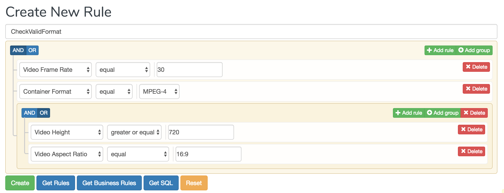
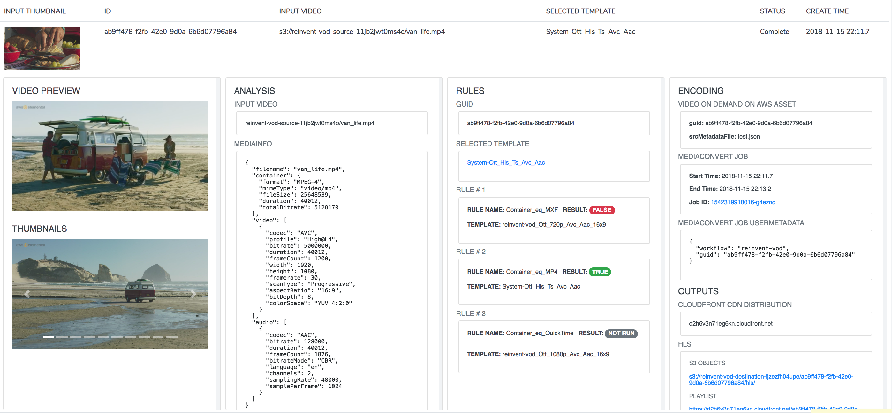

# Media Services VOD Workflow Builder

## Overview

Create flexible, intelligent file-based video workflows on AWS using dynamic rules.

* API for creating rules that can be run against videos to automate encoding decsions and perform quality control for file-based video delivery workflows.  
* A rule execution engine for evaluating dynamic rules within video workflows.
* A serverless application for creating rules
* A sample workflow using dynamic rules.
* A tutorial for how to build the sample application.

### Rule Builder

* Create named rule expressions using a form based user interface.  
* The sample uses [Mediainfo](https://mediaarea.net/en/MediaInfo) video analysis as the domain for creating expressions.  
* The form is implemented using the [JQuery QueryBuilder](https://querybuilder.js.org/index.html) JavaScript project.

    

### Rule Execution

* Rules are executed as a part of a file-based video processing workflow using the [business-rules](https://github.com/venmo/business-rules) Python package in an AWS Lambda.

### Sample VOD workflow using the Video on Demand on AWS Solution

* A sample workflow using the [Video on Demand on AWS](https://aws.amazon.com/answers/media-entertainment/video-on-demand-on-aws/) solution is provided.  The workflow takes a list of _ruleMappings_ as input to the VOD on AWS solution metadata trigger and uses the rule execution lambda function to decide which MediaConvert template (encoding settings) should be used to process a video input as part of an unattended workflow.  ruleMappings have the following format:

    ```json
    ruleMappings [
        {
            "ruleName" : "RuleBuilderRuleName",
            "template" : "MediaConvertJobTemplateName"
        }
    ]
    ```

* A webpage is included to monitor the sample workflow

    


### REST API

All browser actions are performed through an authenticated and SSL encrypted REST API hosted in the cloud. The API can be used by other tools to manage rules, execute rules and monitor the sample workflow.

## Navigate

Navigate to [README](README.md) | [Workshop](RuleBasedEncoding/README.md) 