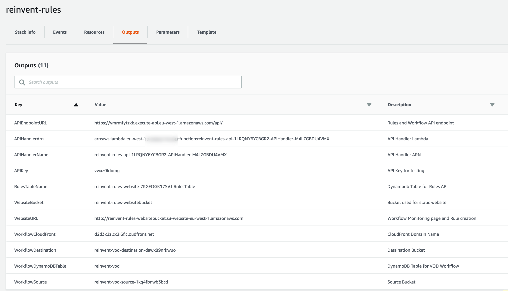
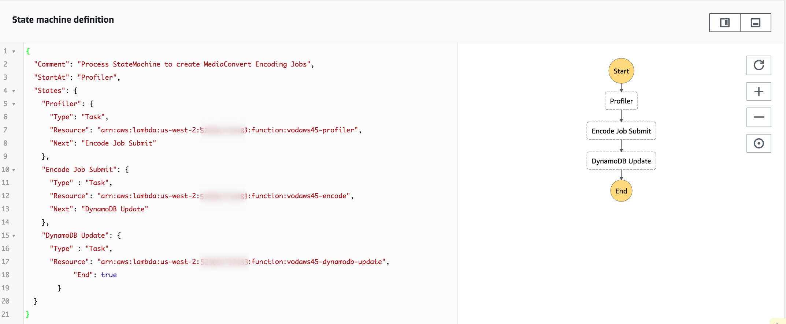

# Customizing the Video On Demand on AWS solution with dynamic encoding rules

## Introduction

If you prefer, skip this introduction and [jump to the start of the step-by-step instructions.](#Deploy-the-Lab-Toolkit)

In this tutorial, you will build additional intelligence into the [Video on Demand on AWS](https://aws.amazon.com/answers/media-entertainment/video-on-demand-on-aws/) (_VOD_) solution by adding dynamic, user-defined rules to make automatic encoding decisions during execution of the workflow.  This change will enable end users who may have access to MediaConvert and the solution S3 bucket, but not the internals of the solution, to develop new video processing workflows without modifying the underlying code for the solution.

The Video on Demand on AWS solution leverages AWS Step Functions, which breaks the workflow into individual steps, making it easier to customize or extend the architecture for your specific video-on-demand needs. For example, you can modify or replace the encoding steps to produce different content sets. You can also add steps to extend support for more complex workflows, including, for example, image processing for poster artwork or additional custom data to the metadata file that will then be stored in Amazon DynamoDB. 

The solution already implements some hard-coded rules that we will replace with dynamic rules.  The existing rules checks the Mediainfo analysis results of the input video and decides on a job template that will avoid producing  _up-converted_ video outputs -  that is videos with a higher resolution than the input video.

## Changes to the Video on Demand solution end-user workflow

When this module is complete the end user experience for using the Video on Demand solution will be as follows: 

1. Create MediaConvert templates (e.g. using the AWS Elemental MediaConvert console).  In our workshop, we will be using existing templates that were either generated from the lab toolkit or system templates provided by MediaConvert.  However, the new workflow supports any MediaConvert template.

    

2. Create Mediainfo Rules using form input on a webpage.  Rules are stored in DynamoDB and can be retrieved by name via an API or AWS Lambda.

    

3. Use input JSON metadata to trigger Video on Demand on AWS workflows. The metadata includes **_Rule Mappings_** to decide on which MediaConvert Template should be used for a specific input using JSON metadata.
  
    

4. View the results of the Video on Demand on AWS jobs in the Workflow webpage.

    

## Overview of Implementation Steps:

The changes to the Video on Demand on AWS solution that are needed to support the new workflow are as follows:

1. Change the Video on Demand on AWS solution user interface (S3 bucket watchfolder) to take a file containing JSON metadata as input, including **Rule Mappings**.  
2. Deploy and configure a serverless web application for creating named expressions, called **_Mediainfo Rules_**, that can be evaluated against facts from Mediainfo metadata for a video.
3. Deploy and configure a **_Mediainfo Rules Engine Profiler_** lambda function that take Mediainfo metadata for a specific video and evaluates a list of Mediainfo Rules and returns the result. 
4. Change the Video on Demand on AWS solution to use the Mediainfo Rules Engine lambda in place of the existing logic to select a job template for a given input.

## Open source used in implementation

The following Open Source packages are used to develop this customization.

* [**jQuery QueryBuilder**](https://querybuilder.js.org/)  An open source JavaScript package that lets you build expressions using a web UI and translates the expression into different query engine formats such as SQL, Elastic Search, etc.  We will be translating the expressions to _business-rules_ JSON format.

* [**business-rules**](https://github.com/venmo/business-rules) - an Open Source Python package that lets you execute rules against a set of configured variables.

# Prerequisites

1. Amazon Web Services account with root or Administrator permissions
2. Video On Demand on AWS stack deployed in the same region you will complete the tutorial in.
3. Google Chrome, Mozilla Firefox, or another current browser with JavaScript enabled.  Google Chrome is recommended.

# Deploy the Lab Toolkit

The lab toolkit is installed in your account using the workshop.yaml CloudFormation template.  This template runs several nested templates that create the S3, API Gateway, IAM and Lambda resources needed to complete the workshop.  We will examine the resources created and modify them as we proceed through the tutorial.  

## Instructions  

1. Click **Launch Stack** to launch the template in your account in the region of your choice.  The stacks should take a few minutes to deploy.


Region | Launch
------|-----


eu-west-1 (Ireland) | [](https://console.aws.amazon.com/cloudformation/home?region=eu-west-1#/stacks/new?stackName=reinvent-rules&templateURL=https://s3.amazonaws.com/rodeolabz-eu-west-1/rules/3-rulesbasedencoding/v3/workshop.yaml)

us-west-2 (Oregon) | [](https://console.aws.amazon.com/cloudformation/home?region=us-west-2#/stacks/new?stackName=reinvent-rules&templateURL=https://s3.amazonaws.com/rodeolabz-us-west-2/rules/3-rulesbasedencoding/v3/workshop.yaml)

2. Name the stack or use the default name `reinvent-rules`.  We will refer to the stack as **reinvent-rules** throughout this tutorial.
3. Fill in the **vodstack** parameter with the name of the stack you created for the Video on Demand solution.  We will refer to this stack as the **reinvent-vod** stack throughout this tutorial.  
4. **Save the stack details page in a browser tab for future reference.**
5. During the installation of the CloudFormation templates you may be prompted to acknowledge the creation of IAM resources.  Click on the check-boxes next to each entry.  Finally,  click the **Create** or **Create Change set** and **Execute** buttons where applicable.

    

## Outputs

The information about the resources created by this stack is in the **Outputs** tab.  For convenience, the outputs of the Video on Demand solution stack are also passed through and listed here as well.  

**Save this page in a browser tab for future reference.  Or, copy and save the outputs to a file.**



* **APIHandlerArn** - ARN of the Lambda function that serves as the back-end for the /rule and /vodonaws APIs
* **APIHandlerName** - Name of the Lambda function that serves as the back-end for the /rule and /vodonaws APIs
* **APIEndpointURL** - HTTPS endpoint for the Rules and Workflow API endpoint	
* **APIKey** - 	API Key for testing	the Rules and Workflow API
* **WebsiteURL** - Workflow Monitoring page and Rule creation	webpages
* **WorkflowCloudFront** - CloudFront Domain Name	for the Video on Demand on AWS solution
* **WorkflowSource** - Source Bucket for the Video on Demand on AWS solution	
* **WorkflowDestination** -	Destination Bucket for the Video on Demand on AWS solution	
* **WorkflowDynamoDBTable** - DynamoDB Table for the Video on Demand on AWS solution	
* **RulesTableName** - DynamoDB Table for Rules API
  
## Other resources we will work with

We will also use the following resources created by the ruleapi nested stack:

* **MediainfoRulesEngineProfiler** - a replacement lambda for the existing Video on Demand on AWS profiler lambda.

# Part 1: Change the Video on Demand on AWS S3 trigger to use input Metadata


The Video on Demand on AWS solution supports two types of S3 workflow triggers:

1. **Video-Only Workflow** 
   
   When a new MP4, MPG, M4V, or MOV video is added to the source Amazon S3 bucket, a Lambda function triggers the ingest workflow. 

2. **Metadata and Video Workflow**
    
    When a new JSON metadata file is added to the source Amazon S3 bucket, a Lambda function triggers the ingest workflow. 

Since we deployed the solution stack using the default, Video-Only Workflow trigger, we will need to change the S3 trigger setting to start the workflow using Metadata and Video.
 
Once the Metadata and Video Workflow is enabled, any key-value pairs we add to the Metadata input file will be available to the Step Functions and Lambdas throughout the workflow. Each time the workflow is initiated, the solution creates a unique identifier (guid). All metadata including the input Metadata is stored in DynamoDB.  The unique identifier is used as the primary key in Amazon DynamoDB and the execution ID in AWS Step Functions. The unique identifier is passed to each step in the workflow, allowing information to be stored and retrieved in DynamoDB. 

We will take advantage of Metadata to allow end-users to pass in addtional information the workflow can use to decide on encoding templates using rules.

## Instructions

Use the steps below to change the **S3 ObjectCreate (All)** event trigger on the **Source** bucket to only trigger if the object created in the bucket has a suffix of "json".  We don't need to make any other changes to the stack since the workflow will automatically handle extracting metadata from .json files.  We will test out passing metadata as part of this step to see how it works.

1. Open the S3 console.
2. Find the **Source** bucket created by the **reinvent-vod** stack and click on the link to open the detail page for the bucket. The bucket name will have a pattern like: `reinvent-vod-source-<unique-string>`.
3. Navigate to the **Properties** tab and click on the **Events** tile in the **Advanced settings** panel at the bottom of the page.
4. On the **Event** card select the radio button for the first **ObjectCreate (All)** event trigger.  This event should have the value `.mpg` in the filter column.  Click on the **Edit** link.
5. Replace the existing value in the **Suffix** box with  `.json` and click **Save** to update the trigger.
   
      

6. On the **Event** card, select the radio button for each non-json  **ObjectCreate (All)** event trigger and click on the **Delete** button.  The only remaining trigger should be the JSON trigger. 

    


## Test the metadata trigger

Now let's create a Video on Demand on AWS workflow using the Metadata trigger.  We'll add an extra, arbitrary,  key-value pair to pass a message to ourselves through the solution.  This shows that JSON attributes added in the input metadata are persisted in the DynamoDB data stored for the workflow.

1. On your computer, create a file called `testMetadata.json`
2. Copy the following JSON into the file and save.  
    ```json
    { 
      "srcVideo": "van_life.mp4", 
      "FrameCapture": true,
      "MetadataTestMessage": "Hello from the other side!" 
    }
    ```
3. Open the S3 console and click on the link for the **Source** bucket that was created by the Video on Demand on AWS workflow.
4. Click on the **Upload** button and use the dialog box to locate and select the `testMetadata.json` input metadata file you just created.
5. Click on the **Upload** button to start the upload.
6. To verify the VOD solution workflow is triggered, open the AWS Step Functions console and find the **reinvent-vod-process** step function.  Click on the link to open the detail page.
7. On the **Executions** panel, find the most recent invocation of the state machine and click the link to go to the details of that invocation.  
8. The **Execution status** should be **Succeeded**.
9.  Now, click on the **Profiler** step in the **Visual Workflow** card.  This will load the input, output and exception information for that step into the **Step details (Profiler)** card.  
10. Expand the twisty for the **Step details (Profiler)** **Outputs** section.
11. Locate the "MetadataTestMessage" key value pair we passed in with the VOD workflow input metadata. 

    

The VOD solution will pass along all the key value pairs in the JSON metadata used to trigger the workflow, even if they are not used by the current workflow.  This behavior will enable us to pass Mediainfo Rules when we trigger a new workflow.  The rules can be used later in code we add to the VOD solution step functions. 

# Part 2: Configure the serverless application used to create rules

The Lab Toolkit stack (`reinvent-rules`) created webpages backed by API Gateway, Lambda and DynamoDB that will be used to:
1) drive the Mediainfo Rule creation 
2) to visualize the workflow data created by the Video on Demand on AWS solution.  

In this section of the workshop, we will configure and test these resources to work with the Video on Demand on AWS solution stack you deployed earlier.


You will need to refer to the stack outputs from the **reinvent-rules** stack throughout this module. 

 The API and Lambda resources created for the **reinvent-rules** stack were developed using [Chalice](https://github.com/aws/chalice), a microframework for writing serverless applications in python. It allows you to quickly create and deploy applications that use AWS Lambda and API Gateway.  For reference, the code for the API is [ruleapi/app.py](ruleapi/app.py).    

The **/rules API Gateway API** creates, manages and executes user-defined rule expressions.  It has the following endpoints:

* **POST /rules/{rule-name}** - create or update a rule with name `rule-name`
* **GET /rules** - list all rules
* **GET /rules/variables** - list all the mediainfo elements that can be used to write new rules.
* **GET /rules/{rule-name}** - list the rule named `rule-name`

The **/vodonaws API Gateway API** has the following endpoints.

* **GET /vodonaws** - list all instances of the Video on Demand on AWS workflow

## Instructions

### Test the API in the browser
  
1. Open the link for **APIEndpointURL** output from the **reinvent-rules** stack in a new browser tab.
2. You should see a "Hello World!" response.
  
   

3. Now add `/vodonaws` to the end of the URL.  You should see a "Forbidden" message because the /vodonaws API is configured to require and API key which we will add in the next step. 

    

4. Now add `/rules` to the end of the EndpointURL value in your browser.  You should see a "Forbidden" message because the /rules API is configured to require and API key which we will add in the next step.

   


### Configure the VOD on AWS **Workflow** and **Rules** webpages

The Mediainfo Rules Web Application is secure after installation because it requires an API key to access any of the REST API endpoints, and the CloudFormation template doesn't configure API keys for the web application automatically. **By default, no access is possible until the following steps are performed.**

#### Instructions for First Run (Important)

Each time the Mediainfo Rules web application is launched, the browser's locally stored cookies are checked for any previous API connection information. If a previous connection is found, it is used by the browser automatically on the next launch.

An API key was created in the reinvent-rules toolkit stack.

1. Go to the **AWS API Gateway** console page.
2. Select the **API Keys** tab
3. Click on the API Key named **TestUserAPIKey**.  This API key was created by the **reinvent-rules** stack. 

    

4. Click the **Show** option to see the actual API Key
5. Copy the API Key
  
    

6. Find the **WebsiteURL** output parameter from the **reinvent-rules** stack and open the link in a new browser tab.
7. Click on the **Setup** button at the top of the web page.
8. Enter the API key you copied in the **API Key** box.
9. Enter the API endpoint you tested in the previous section in the **Endpoint URL** box (i.e. the **APIEndpointURL** output from the **reinvent-rules** stack). 

    

10. Click on the **Save** button to save the settings.
 

### Test the **Workflow** web page

The workflow webpage displays the output of the **GET /vodonaws** request.

1. After entering the API endpoint you should see a list of Video on Demand on AWS workflow instances you ran in previous modules of this tutorial.

    

2. Click on any of the rows to see the details for that workflow instance.

    

## Test the **Rules** webpage and create some rules to use later

The **Rules** webpage lists all the rules that have been created.  It displays the results of the **GET /rules** API request.

The **Create Rule** button on the **Rules** webpage lets you create or update a rule to be managed by the web application.  It uses the form input as parameters to the **POST /rules/{rule-name}** API request.

**IMPORTANT: Make sure to create the exact rules listed in these steps.  We will use these later to test the end to end workflow.**

1. Navigate to the **Rules** webpage by selecting the **Rules** button at the top of the **Workflow** webpage.  You can toggle back and forth between the pages using these buttons.  
2. Click on **Create rule**.
3. Fill in the expression builder form to create a rule that tests if the container type of the input file is MXF and name it `Container_eq_MXF`.   
   
    

  
4. Finally use the **Create** button to save the rule so we can refer to it later.  Clicking on **Create** will call the **POST /rules/{rule_name}** API with the form input.  
5. Repeat this step with a rule that checks for the container type of the input file is MP4 and name it `Container_eq_MP4`.
6. Repeat this step with a rule that checks for the container type of the input file is QuickTime and name it `Container_eq_QuickTime`. 
7. Now you should have the following rules defined on the Rules webpage.
   
   

# Part 3: The new MediainfoRulesEngineProfiler lambda function

Earlier in this workshop we changed the trigger for the VOD solution to use metadata JSON files so we can pass in Mediainfo Rule Mappings that can be used to select encoding settings based on the attributes of the video.  

We have one more change to the VOD solution so it can use the Mediainfo Rule Mappings.  We need to replace he hard-coded, static rules in the Process Step Function to execute the rules specified in the input metadata ruleMappings using the Python business-rules package.  


To understand this change we will do a quick overview of the existing **reinvent-vod-process** lambda function and the **reinvent-rules-MediainfoRulesEngineProfiler** lambda function.  More detailed code walkthoughs and testing can be found in [Appendix 1: Code Walktroughs](#Appendix-1:-Code-Walktroughs) below.

## Locate the Process Step Function and the Profiler Lambda function

The decision making for which template to use for the Video on Demand on AWS workflow is located in the _profiler_ lambda.  This lambda is invoked as a step in the _Process_ step function.  We will replace this lambda function with a new lambda that uses the Python **business-rules** package to evaluate our Mediainfo Rules.

We'll examine the inputs and outputs of this Lambda.  The new lambda needs to to use the same inputs and outputs in order to fit in the state machine.

1. Open the Step Functions AWS console.
2. Click on the link for the `reinvent-vod-process` step function.
3. Click on a link for one of the successful **Executions** of the step function.
4. From the Visual Workflow for the step function display on this page, you can see the Profiler step that triggers the profiler lambda.

    

5. Click on the **Profiler** node in the **Visual Workflow** to show the inputs and outputs for the step.  This is what is passed in and out of the reinvent-vod-profiler lambda function. 

6. The input is the guid for the Video on Demand on AWS workflow.

    

7. The output is the updated workflow JSON that will be stored in reinvent-vod-table DynamoDB in table.  

    


8. We will need to make sure our new lambda has the same inputs and outputs as the old lambda.  As you will see when we examine the reinvent-vod-profiler lambda, the highlighted key-value pairs in the JSON above are what is modified by the reinvent-vod-profiler function.  The rest of the JSON was retrieved from data stored in reinvent-vod-table from previous workflow steps. Note that the Mediainfo analysis is already available in the **srcMediainfo** element of the workflow JSON object at the start of this step.

9. Click on the lambda function link in the **Resource** section of the **Step details (Profiler)** panel to open the console page for the **reinvent-vod-profiler** lambda.
     
## Profiler lambda overview

The profiler lambda does the following:

* Get the latest workflow data from DynamoDB and copy it in to the _event_ output JSON object.  
* Retrieve the Mediainfo analysis from the workflow data and set the outputs that come directly from Mediainfo.
* Decide what MediaConvert Job Template to use based on the resolution of the input video (Height x Width).  **This is the key piece of code we need to replace with our dynamic rules execution from the mediainfoRulesEngine lambda**.
* Return results in the event object.  The results include the name of the MediaConvert job template to use to convert the video.

For a more detailed walk-through see the Appendix [Profiler lambda](#Profiler-lambda) below.

## MediainfoRulesEngineProfiler lambda overview

The MediainfoRulesEngineProfiler lambda is our replacement lambda for the profiler lambda.  It executes the Mediainfo Rules the user specifies and selects a mapped MediaConvert job template based on the results.  

The new lambda starts with the logic from the existing profiler lambda.  If no template is found using the ruleMappings, it will fall back to selecting a template using the existing method.

The ruleMappings input is specified by the user in the JSON metadata file that is used to trigger the workflow.   It can be accessed by our lambda from the workflow information stored in DynamoDB ruleMappings have following format:

```json
"ruleMappings": [
    {
        "ruleName": "Rule1",
        "template": "Template1"
    },
    {
        "ruleName": "Rule2",
        "template": "Template2"
    },
    ...
    {
        "ruleName": "RuleN",
        "template": "TemplateN"
    }
]
```

Each ruleName is the key for the store business-rules JSON object that was created using the Rules web page.  Each template is the key for the stored MediaConvert job template create using the AWS Elemental MediaConvert service.

The lambda Performs the following steps.  Steps that different from the existing profiler lambda are labelled with the keyword NEW:

  * **NEW: Rules API DynamoDB table is mapped from the Lambda Enviornment**
  * Get the latest workflow data for this guid from DynamoDB
  * Retrieve the Mediainfo analysis from the workflow data and set the outputs that come directly from Mediainfo.
  * **NEW: Retrieve the ruleMappings from the workflow data.**
  * **NEW: Decide on a MediaConvert job template** 
  
    For each ruleMapping passed in by the end-user:
    * Look up the rule JSON in the **reinvent-vod-RulesTable**.
    * Evaluate the rule using the Python **business-rules** package.
    * If the rule expression evaluates to TRUE, select the mapped template and break.
  
    This implements IF-THEN-ELSE semantics.  The ELSE case falls back to using the the solution default templates based on the video resolution.  Test results for each rule executed are stored in the ruleMapping JSON elements of the event JSON object. 

  * Decide what _default_ MediaConvert Job Template to use based on the resolution of the input video (Height x Width)
  * **NEW** Select the default template if no template was selected from the business-rules execution step.
  * Return results in the event object. The results include the name of the MediaConvert job template to use to convert the video.

The resulting code is in **mediainfoRuleEngineProfiler**.  

For a more detailed code walkthough see Appendix  [MediainfoRulesEngineProfiler lambda](MediainfoRulesEngineProfiler-lambda) below.

# Part 4: Replace static rules with dynamic rules in the Video on Demand on AWS solution 

In this section we will replace the **profiler** lambda in **Process** step function with the **mediainfoRuleEngineProfiler** lambda.

### Instructions

1. Open the AWS Lambda console and search for the pattern `reinvent-rules-api` to find the lambdas created by the ruleapi nested stack.  The mediainfoRuleEngineProfiler lambda should be in the list.  The name may be truncated if the function was created from a nested stack:

    


2. Click on the link to go to the detail page for the lambda. 
3. Copy the ARN for the lambda from the top of the page.
4. Once again, open the **Step functions->State machines** AWS console page.
5. Find the `reinvent-vod-process` step function and click on the link to go to the **Details** page.
6. Click on the **Definition** tab in the lower panel of the page.

    

7. Click the **Edit** button at the top of the page.
8.  To replace the Profiler lambda in the **Process** state machine, we will simply copy the ARN for our new lambda and use it as the new value for the **States['Profiler']['Resource']** JSON element.

    

9.  Click **Save**
10. Save this page in a browser tab to use in the test step below.

## Test the end to end workflow

1.  On your computer, create a file called `test.json` and copy the following JSON into the the file.  If you named your VOD solution stack something other than **reinvent-vod**, you will need to replace the prefix with your stack name:

    ```json
    {
      "srcVideo": "van_life.mp4",
      "FrameCapture": true,
      "ruleMappings": [
        {
          "ruleName": "Container_eq_MXF",
          "template": "reinvent-vod_Ott_720p_Avc_Aac_16x9"
        },
        {
          "ruleName": "Container_eq_MP4",
          "template": "System-Ott_Hls_Ts_Avc_Aac"
        },
        {
          "ruleName": "Container_eq_QuickTime",
          "template": "reinvent-vod_Ott_1080p_Avc_Aac_16x9"
        }
      ]
    }
    ```

2. Open the S3 console and click on the link for the `reinvent-vod-source` bucket that was created by the Video on Demand on AWS workflow.
3. Click on the **Upload** button and use the dialog box to locate and select the `test.json` input metadata file you just created.
4. Click on the **Upload** button to start the upload.
5. Go back to the details page for the **Process** Step Function.
6. Find the most recent invocation of the function in the **Execution** panel and click on the link to see the execution details.
7. The **Execution status** should be **Succeeded**
8. Check the **Outputs** in the **Step details** panel to make sure there are ruleMappings and testResults in the output.
9. Finally, open the **Workflow** web page.  Find the most recent workflow run and click on the row to show the workflow details.
10. You should see results of you rule execution for your test job.

    

11. You will notice that the result of the rule execution is listed in the details of the workflow instance.
    
## More things to try

### Test the workflow with different inputs

To show that different templates are chosen for different inputs, replace the **srcVideo** value in the previous step with different input videos. Try:

* `starlight_2160p59.m2ts` - no matching rule so the default, resolution based decision making will be used to select a template.
* `silksintrees_MPEG2.mxf` - the first ruleMapping is selected.

### Test the workflow with different rules

1. Add a rule to test for HEVC codec called `Codec_is_HEVC`.
2. Add a rule to test for 
3. Create a workflow that uses the new rules.


### Add a new MediaConvert template and use it in a ruleMapping

You can create your own MediaConvert templates in AWS Elemental MediaConvert ([documentation](https://docs.aws.amazon.com/mediaconvert/latest/ug/creating-template-from-scratch.html)) or use one of the templates generated by the tutorial.

1. Open a file on you computer and name it `replaceTemplates.json`.
2. Add the following JSON to the file.  This replaces the templates we used previously with new templates.  The templates in the sample are already created, but you can replace them with your own:

    ```json
    {
      "srcVideo": "van_life.mp4",
      "FrameCapture": true,
      "ruleMappings": [
        {
          "ruleName": "Container_eq_MXF",
          "template": "reinvent-vod_Ott_720p_Avc_Aac_16x9"
        },
        {
          "ruleName": "Container_eq_MP4",
          "template": "System-Ott_Hls_Ts_Avc_Aac"
        },
        {
          "ruleName": "Container_eq_QuickTime",
          "template": "reinvent-vod_Ott_1080p_Avc_Aac_16x9"
        }
      ]
    }
    ```


# Conclusion

You have successfully completed the Rules Based Encoding workshop!  At this point, you should have a feel for how to modify the internals of the Video on Demand on AWS solution as well as  how the VOD solution might work as part of a larger application.

What you accomplished:

1. Changed the Video on Demand on AWS solution user interface from Video to Metadata inputs.
2. Deployed and configured a serverless web application for creating named expressions, called **_Mediainfo Rules_**, that can be evaluated against facts from Mediainfo metadata for a video.
3. Deployed and inspected a **_MediainfoRulesEngineProfiler_** lambda function that uses Mediainfo metadata for a specific video and evaluates a list of Mediainfo Rules to select a MediaConvert job template to use to process the video.
4. Changed the Video on Demand on AWS solution to use the MediainfoRulesEngineProfiler lambda in place of the existing logic to select a job template.
   
Thank you for completing the workshop!

# Cleanup

Delete the S3 bucket created by the `reinvent-rules` stack.

1. Find the value of the **WebsiteBucket** Output from the **reinvent-rules** stack and copy it.
2. Open the S3 console and search for the WebsiteBucket value.
3. Click on the bucket icon and delete the bucket.

Delete the `reinvent-rules` CloudFormation stack.

1. Open the CloudFormation console.
2. Select the reinvent-rules stack radio button.
3. Select **Delete stack** from the **Actions** drop down.

# Appendix: Code Walkthroughs

## profiler lambda

The first thing to notice is that this is Node.js! The **mediainfoRuleEngineProfiler** lambda is written in Python, so we won't be copying code back and forth.  The good news is that since we are using the function as a service model, we can have lambdas in any combination of programming languages we want.  In this case, we want to take advantage of the open source business-rules python package, so we choose Python for our new lambda and reimplement the parts of the **Profiler** lambda that we need to match its interface to the VOD solution.

* The first part of the lambda gets the latest workflow data from DynamoDB and copy it in to the _event_ output JSON object.  
* Retrieve the Mediainfo analysis from the workflow data and set the outputs that come directly from Mediainfo.
* Decide what MediaConvert Job Template to use based on the resolution of the input video (Height x Width).  **This is the key piece of code we need to replace with our dynamic rules execution from the mediainfoRulesEngine lambda**.

    ```javascript
        //Determine Encoding profile by matching the src Height to the nearest profile.
        const profiles = [2160, 1080,720];
        let lastProfile;
        let encodeProfile;

        profiles.some(function(p) {
          let profile = Math.abs(event.srcHeight - p);
          if (profile > lastProfile) {
            return true;
          }
          encodeProfile = p;
          lastProfile = profile;
        });
        event.EncodingProfile = encodeProfile;
        
        if (event.FrameCapture) {
          // Match Height x Width with the encoding profile.
          const ratios = {
            '2160':3840,
            '1080':1920,
            '720':1280
          };
          event.frameCaptureHeight = encodeProfile;
          event.frameCaptureWidth = ratios[encodeProfile];
        }

        // Update:: added support to pass in a custom encoding Template instead of using the
        // solution defaults

        if (!event.jobTemplate) {
          // Match the jobTemplate to the encoding Profile.
          const jobTemplates = {
            '2160': event.jobTemplate_2160p,
            '1080': event.jobTemplate_1080p,
            '720': event.jobTemplate_720p
          };

          event.jobTemplate = jobTemplates[encodeProfile];
          console.log('Encoding jobTemplates:: ', event.jobTemplate);
        }
    ```

* Return our results in the event object.

## MediainfoRulesEngineProfiler lambda

We'll start with **profiler** lambda and replace the template decision making code with rule evaluation using the Python business-rules engine package.  

The resulting code is in **mediainfoRuleEngineProfiler**.  Let's do a walk-through of the code and then run a test:

1. Open the AWS Lambda console and search for the pattern `reinvent-rules-api` to find the lambdas created by the ruleapi nested stack.  The mediainfoRuleEngineProfiler lambda should be in the list.  The name may be truncated if the function was created from a nested stack:

    


2. Click on the link to go to the detail page for the lambda.  
3. Scroll down to the **Function code** panel to examine the code.
4. Find the function **mediainfoRuleEngineProfiler** in the file **app.py**.
5. Walk-through the code and note the steps listed below.
  
### Walk-through the mediainfoRuleEngineProfiler

  * **from profiler:** Input is {"guid":"guid-value"}
  * **from profiler:** Video on Demand on AWS workflow table is mapped from the Lambda Environment.
  * **NEW CODE** Rules API DynamoDB table is mapped from the Lambda Enviornment
  * **from profiler:** Get the latest workflow data for this guid from DynamoDB
  * **from profiler:** Get mediainfo analysis results that were collected earlier in the workflow
  * **from profiler:** Set outputs that are based on mediainfo
  * **NEW CODE** Decide on a MediaConvert encoding template by running the mediainfo business-rules and selecting the first mapped template whose rule is true.  This implements IF-THEN-ELSE semantics.  The ELSE case is to use the solution default templates.  Test results for each rule executed are stored in the ruleMapping JSON elements of the event JSON object.

      ```python
      if ('ruleMappings' in event):
                  video = Mediainfo(mediaInfo)

                  for ruleMapping in event['ruleMappings']:

                      ruleMapping['testCreateTime'] = datetime.utcnow().strftime(
                          '%Y-%m-%d %H:%M.%S')

                      logger.info("rule: {}".format(json.dumps(
                          ruleMapping, indent=4, sort_keys=True)))

                      response = rulesTable.get_item(
                          Key={'name': ruleMapping['ruleName']}, ConsistentRead=True)
                      logger.info("running test {}".format(
                          json.dumps(response, cls=DecimalEncoder)))

                      businessRules = response['Item']['rules']

                      ruleMapping['testResult'] = run_all(rule_list=    [businessRules],
                          defined_variables=MediainfoVariables(video),
                          defined_actions=MediainfoActions(video),
                          stop_on_first_trigger=True)

                      logger.info("test result {}".format(json.dumps(
                          ruleMapping['testResult'], cls=DecimalEncoder)))

                      if ruleMapping['testResult'] == True:
                          event['jobTemplate'] = ruleMapping['template']
                          break
      ```

  * **from profiler:** Determine the resolution of the input to set the FrameCapture settings and calculate default profile.
  *  **from profiler:** Set default template if no template was selected from the business-rules
  * **from profiler:** Output is the event JSON object

## Test the new lambda

1. To facilitate testing, the new lambda has a hard-coded test data you can use instead of getting the workflow datafrom DynamoDB  Take a moment to examine the test data, MEDIAINFO_BUSINESSRULES_PROFILER_TEST, located just above the **mediainfoRuleEngineProfiler** function in app.py.
2. Make sure the line of code for running the test is set to `True`

      ```python
      testLambda = True
        if (testLambda):
            event = MEDIAINFO_BUSINESSRULES_PROFILER_TEST
        else:
            response = vodonawsTable.get_item(Key={'guid': guid})
            event = response['Item']
      ```

3. Save the Lambda.
4. Select **Configure test event** from the lambda toolbar.  
5. In the dialog box, check **Create new test event**.
6. Enter `dummyGuid` as the **Event name**.
7. Paste the JSON below into the the code box.  This is just a fake guid to start the workflow.  We will be using the test DynamoDB table data to test the lambda rather than looking up a workflow in DynamoDB.
   
   ```json
   {"guid":"notarealguid"}
   ```

8. Click **Create**
9.  Click on the **Test** button.
10. The Lambda **Execution result** should be successful and the output in the **Execution result** panel should look like this.  Note that the output **ruleMappings** element now contain a **testCreateTime** for when the test was run and a **testResult** with the result of the test execution for this input:

    ```json
    {
      "guid": "67ea0602-49a9-48c8-bebd-d3bb4641665e",
      "destBucket": "vodaws45-destination-tc1fbugf08dz",
      "workflowStatus": "Ingest",
      "frameCapture": true,
      "srcMetadataFile": "944faeca-b2e5-47c4-adde-6c09ecbaec87.json",
      "jobTemplate_2160p": "vodaws45_Ott_2160p_Hevc_Aac_16x9",
      "jobTemplate_720p": "vodaws45_Ott_720p_Hevc_Aac_16x9",
      "workflowName": "vodaws45",
      "jobTemplate_1080p": "vodaws45_Ott_1080p_Hevc_Aac_16x9",
      "archiveSource": false,
      "ruleMappings": [
        {
          "ruleName": "Container_eq_MXF",
          "template": "theTemplateForContainer_eq_MXF",
          "testCreateTime": "2018-10-05 18:11.48",
          "testResult": false
        },
        {
          "ruleName": "Container_eq_MP4",
          "template": "theTemplateForContainer_eq_MP4",
          "testCreateTime": "2018-10-05 18:11.48",
          "testResult": true
        },
        {
          "ruleName": "Container_eq_Prores",
          "template": "theTemplateForContainer_eq_Prores"
        }
      ],
      "srcMediainfo": "{\n  \"filename\": \"futbol_720p60.mp4\",\n  \"container\": {\n    \"format\": \"MPEG-4\",\n    \"mimeType\": \"video/mp4\",\n    \"fileSize\": 229066618,\n    \"duration\": 180224,\n    \"totalBitrate\": 10168085\n  },\n  \"video\": [\n    {\n      \"codec\": \"AVC\",\n      \"profile\": \"High@L3.2\",\n      \"bitrate\": 10000000,\n      \"duration\": 180200,\n      \"frameCount\": 10812,\n      \"width\": 1280,\n      \"height\": 720,\n      \"framerate\": 60,\n      \"scanType\": \"Progressive\",\n      \"aspectRatio\": \"16:9\",\n      \"bitDepth\": 8,\n      \"colorSpace\": \"YUV 4:2:0\"\n    }\n  ],\n  \"audio\": [\n    {\n      \"codec\": \"AAC\",\n      \"bitrate\": 93375,\n      \"duration\": 180224,\n      \"frameCount\": 8448,\n      \"bitrateMode\": \"CBR\",\n      \"language\": \"en\",\n      \"channels\": 2,\n      \"samplingRate\": 48000,\n      \"samplePerFrame\": 1024\n    }\n  ]\n}",
      "startTime": "2018-09-28 18:14.9",
      "srcVideo": "futbol_720p60.mp4",
      "srcBucket": "vodaws45-source-1xc27xd0jfvkc",
      "FrameCapture": true,
      "srcHeight": 720,
      "srcWidth": 1280,
      "jobTemplate": "theTemplateForContainer_eq_MP4",
      "EncodingProfile": 720,
      "frameCaptureHeight": 720,
      "frameCaptureWidth": 1280
    }
    ```

11. If the test passed, you are ready to try the dynamic rules in the Video on Demand on AWS workflow.  Make sure the line of code for running the test in the mediainfoRuleEngineProfiler lambda is set to `False`

      ```python
      testLambda = False
        if (testLambda):
            event = MEDIAINFO_BUSINESSRULES_PROFILER_TEST
        else:
            response = vod-on-awsTable.get_item(Key={'guid': guid})
            event = response['Item']
      ```

12. Save the Lambda
13. Scroll to the top of the page and copy the ARN for the lambda.


# Appendix: Next steps

Feel free to enter a pull request if you want to add to this project!

Some desired features:

* **track selection**  

    The current implementation is limited:
    * assumes only one video track in the input 
    * only tests container and video analysis


* **add other types of analysis/rules** such as ffmpeg for black detection, silence detection, ffprobe. 

* **Replace Python business-rules package with IOT Rules.**  There's always more than one way to do something!  I think we could use IOT Rules for this workflow by generating an SQL expression for each rule and creating a DynamoDB trigger rules with the following structure, name each track then write each rule as a column output of the select clause :

    ```
    SELECT 
        mediainfo.container AS container, mediainfo.video[0] AS video0, ..., 
        mediainfo.audio[0] AS audio0, ...,
        mediainfo.text[0] AS text0, ...,
        (rule 1 expression) AS rule1result, ..., 
        (rule N expression) AS ruleNresult
    FROM
        mediainfo
    ```

    The rule would insert the result of each expression into a DynamoDB table.  A DynamoDB trigger could be used to apply the rule mappings to select a template and continue the workflow.
